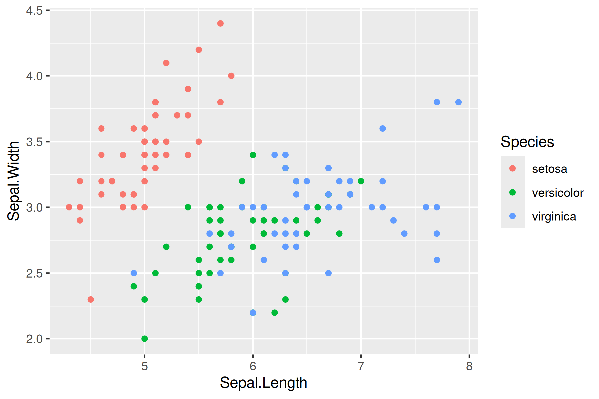

## Fine tuning ggplots

### Libraries

```{r}
library(tidyverse)
library(janitor)
library(plotly)
library(DT)
library(lubridate)
library(plotly)
```

### Basic Graph Labels

```{r}
  ggplot(data = iris, aes(x = Sepal.Length, y = Sepal.Width)) +
    geom_point(aes(color=Species, shape=Species)) +
    labs(title = "Iris Sepal Length vs Wide", x = "Sepal Length", y = "Sepal Width", color = "Plant Species", shape = "Plant Species") 
```

### Themes

```{r}
  ggplot(data = iris, aes(x = Sepal.Length, y = Sepal.Width)) +
    geom_point(aes(color=Species, shape=Species)) +
    labs(title = "Iris Sepal Length vs Wide", x = "Sepal Length", y = "Sepal Width", color = "Plant Species", shape = "Plant Species") +
  theme_classic()
```

### Colors

```{r}
  ggplot(data = iris, aes(x = Sepal.Length, y = Sepal.Width)) +
    geom_point(color = "red", aes(shape = Species))+
    labs(title = "Iris Sepal Length vs Wide", x = "Sepal Length", y = "Sepal Width") 
```

```{r}
ggplot(data = iris, aes(x = Sepal.Length, y = Sepal.Width)) + geom_point(aes(color = Species, shape = Species)) + scale_color_manual(values=c("blue", "purple", "red")) + labs(title = "Iris Sepal Length vs Wide", x = "Sepal Length", y = "Sepal Width")
```

```{r}
  ggplot(data = iris, aes(x = Sepal.Length, y = Sepal.Width)) +
    geom_point(aes(color = Species, shape = Species)) +
    scale_color_brewer(palette="Dark2") +
    labs(title = "Iris Sepal Length vs Wide", x = "Sepal Length", y = "Sepal Width") 
```

```{r}
library(viridisLite)
  ggplot(data = iris, aes(x = Sepal.Length, y = Sepal.Width)) +
    geom_point(aes(fill = Species), color = "black", pch=21) +
    labs(title = "Iris Sepal Length vs Wide", x = "Sepal Length", y = "Sepal Width") 
```

```{r}
library(viridisLite)
  ggplot(data = iris, aes(x = Sepal.Length, y = Sepal.Width)) +
    geom_point(aes(color = Species, shape = Species)) +
    scale_colour_viridis_d() +
    labs(title = "Iris Sepal Length vs Wide", x = "Sepal Length", y = "Sepal Width") 
```

### Understanding Directory Paths

Absolute Path: Starts from the root directory (/) and specifies the full path to a file or directory.

My absolute path: /home/kcburns_umass_edu

Relative Path: Starts from the current working directory.

Example: images/star_virus.png (if you’re already in /home/jlb)

```{r}
NEON_MAGs <- read_tsv("/work/pi_bio678_umass_edu/data_NEON/exported_img_bins_Gs0166454_NEON.tsv")
```

### Controlling graph size in Markdown

The dimensions of an individual graph in the Markdown document be adjusted by specifying the graph dimensions in the header for the r code chunk.

#\| fig-height: 20 #\| fig-width: 8

This is similar to what we used in previous labs where we wanted to show but not run the code

#\| eval: false

If you want to run the code but not show the code

#\| echo: false

### Graphic Output\*\*

```{r}
# Plot graph to a pdf outputfile
pdf("../images/iris_example_plot1.pdf", width=6, height=3)
ggplot(data = iris, aes(x = Sepal.Length, y = Sepal.Width, color = Species)) + 
  geom_point() +
  labs(title = "Iris Sepal Length vs Wide", x = "Sepal Length", y = "Sepal Width") 
dev.off()
```

```{r}
# Plot graph to a png outputfile
ppi <- 300
png("../images/iris_example_plot2.png", width=6*ppi, height=4*ppi, res=ppi)
ggplot(data = iris, aes(x = Sepal.Length, y = Sepal.Width, color = Species)) + 
  geom_point()
dev.off()
```

### Markdown loading images



### Interactive graphs

```{r}
library(plotly)
```

```{r}
# Version 1
ggplotly(
  ggplot(data = iris, aes(x = Sepal.Length, y = Sepal.Width, color = Species)) + 
    geom_point()
 )
```

```{r}
# Version 2
p <- ggplot(data = iris, aes(x = Sepal.Length, y = Sepal.Width, color = Species)) + 
  geom_point()
ggplotly(p)
```

## Examples with NEON Data

### This first block of code is for both the freshwater and soil MAGs

```{r}
NEON_MAGs_prelim <- read_tsv("/work/pi_bio678_umass_edu/data_NEON/exported_img_bins_Gs0166454_NEON.tsv") |>
  
  clean_names() |> 
  
  # Add a new column community corresponding to different communities names in the genome_name
  mutate(community = case_when(
    str_detect(genome_name, "Freshwater sediment microbial communities") ~ "Freshwater sediment microbial communitie",
    str_detect(genome_name, "Freshwater biofilm microbial communities") ~ "Freshwater biofilm microbial communities",
    str_detect(genome_name, "Freshwater microbial communities") ~ "Freshwater microbial communities",
    str_detect(genome_name, "Soil microbial communities") ~ "Soil microbial communities",
    TRUE ~ NA_character_
  )) |> 
  
  # Create a column type that is either Freshwater or Soil
  mutate(type = case_when(
    str_detect(genome_name, "Freshwater sediment microbial communities") ~ "Freshwater",
    str_detect(genome_name, "Freshwater biofilm microbial communities") ~ "Freshwater",
    str_detect(genome_name, "Freshwater microbial communities") ~ "Freshwater",
    str_detect(genome_name, "Soil microbial communities") ~ "Soil",
    TRUE ~ NA_character_
  )) |> 
  
  # Get rid of the communities strings
  mutate_at("genome_name", str_replace, "Freshwater sediment microbial communities from ", "") |> 
  mutate_at("genome_name", str_replace, "Freshwater biofilm microbial communities from", "") |> 
  mutate_at("genome_name", str_replace, "Freshwater microbial communities from ", "") |> 
  mutate_at("genome_name", str_replace, "Soil microbial communities from ", "") |> 

  # separate site from sample name 
  separate(genome_name, c("site","sample_name"), " - ") |>   
  
  # Deal with these unknow fields in the sample name by creating a new column and removing them from the sample name
  mutate(sample_unknown = case_when(
    str_detect(sample_name, ".SS.") ~ "SS",
    str_detect(sample_name, ".C0.") ~ "C0",
    str_detect(sample_name, ".C1.") ~ "C1",
    str_detect(sample_name, ".C2.") ~ "C2",
    TRUE ~ NA_character_
  )) |> 

# These fields are all associated with "Freshwater microbial communities from...   
# SS - near stream sensor
# C0 - non-stratified lake/river surface near buoy
# C1 - stratified lake surface/epilimnion near buoy
# C2 - stratified lake hypolimnion near buoy
# EPIPSAMMON  - biofilm on sand/silt
# EPILITHON - biofilm on rocks/cobbles
# EPIPHYTON - biofilm that grows on the stems and leaves of aquatic plants
  
# These fields are all associated with "Freshwater biofilm microbial communities from
# EPILITHON - biofilm on rocks/cobbles
  
# These fields are all associated with "Freshwater sediment microbial communities from 
# EPIPSAMMON - biofilm on sand/silt
  
  mutate_at("sample_name", str_replace, ".SS", "") |> 
  mutate_at("sample_name", str_replace, ".C0", "") |> 
  mutate_at("sample_name", str_replace, ".C1", "") |> 
  mutate_at("sample_name", str_replace, ".C2", "") |> 
  

  # Get rid of the the common strings at the end of sample names
  mutate_at("sample_name", str_replace, "-GEN-DNA1", "") |>  
  mutate_at("sample_name", str_replace, "-COMP-DNA1", "") |>  
  mutate_at("sample_name", str_replace, "-COMP-DNA2", "") |>  
  mutate_at("sample_name", str_replace, ".DNA-DNA1", "") |>
  mutate_at("sample_name", str_replace, "_v2", "") |>
  mutate_at("sample_name", str_replace, " \\(version 2\\)", "") |>
  mutate_at("sample_name", str_replace, " \\(version 3\\)", "") |>
  
# Separate out the taxonomy groups
  separate(gtdb_taxonomy_lineage, c("domain", "phylum", "class", "order", "family", "genus"), "; ", remove = FALSE)
```

### This block is for separating out the freshwater sample names

```{r}
NEON_MAGs_freshwater <- NEON_MAGs_prelim |>
  filter(type == "Freshwater") |>
  # separate the Sample Name into Site ID and plot info
  separate(sample_name, c("site_ID","date", "layer", "subplot"), "\\.", remove = FALSE) |>
  mutate(quadrant = NA_character_)
```

### This block is for separating out the soil sample names

```{r}
NEON_MAGs_soil <- NEON_MAGs_prelim |>
  filter(type == "Soil") |>
  # separate the Sample Name into Site ID and plot info
  separate(sample_name, c("site_ID","subplot.layer.date"), "_", remove = FALSE,) |> 
  # some sample names have 3 fields while others have a fourth field for the quadrant. This code create a field for the quadrant when present and adds na for samples from combined cores.
  extract(
    subplot.layer.date,
    into = c("subplot", "layer", "quadrant", "date"),
    regex = "^([^-]+)-([^-]+)(?:-([^-]+))?-([^-]+)$",
    remove = FALSE
  ) |>
  mutate(quadrant = na_if(quadrant, "")) |>
  select(-subplot.layer.date)
```

### This combines soil and freshwater data frames

```{r}
NEON_MAGs <-bind_rows(NEON_MAGs_freshwater, NEON_MAGs_soil) |>
  # This changes the format of the data column
  mutate(date = ymd(date))
```

### Finding rows with NA

To see which rows in a column contain NA:

filter(is.na(column_name))

These represent potential novel taxonomic groups. If you would like to replace NA with unknown or novel:

mutate(column_name = replace_na(column_name, "novel"))

## NEON Graphs

### Bar Plots

Counts produced by ggplot:

```{r}
NEON_MAGs |> 
mutate(phylum = replace_na(phylum, "***NOVEL***")) |>
ggplot(aes(x = phylum)) +
  geom_bar() +
  coord_flip()
```

```{r}
NEON_MAGs |> 
ggplot(aes(x = fct_infreq(phylum))) +
  geom_bar() +
  coord_flip()
```

Counts passed to ggplot:

```{r}
NEON_MAGs |> 
  count(phylum) |> 
ggplot(aes(x = phylum, y = n)) +
  geom_col(stat = "identity") +
  coord_flip()
```

Stacked vs. multiple bar plots:

```{r}
NEON_MAGs |> 
  mutate(phylum = replace_na(phylum, "***UNKNOWN***")) |> 
ggplot(aes(x = fct_rev(fct_infreq(phylum)), fill = type)) +
  geom_bar() +
  coord_flip() +
  labs(title = "2023 and 2024 NEON MAG Taxonomic Distribution", x = "Count", y = "Phylum") 
```

```{r}
NEON_MAGs |> 
mutate(phylum = replace_na(phylum, "***NOVEL***")) |>
ggplot(aes(x = fct_rev(fct_infreq(phylum)), fill = type)) +
  geom_bar(position = "dodge") +
  coord_flip()
```

```{r}
NEON_MAGs |> 
mutate(phylum = replace_na(phylum, "***NOVEL***")) |> 
ggplot(aes(x = fct_rev(fct_infreq(phylum)), fill = type)) +
  geom_bar(position = position_dodge2(width = 0.9, preserve = "single")) +
  coord_flip()
```

### Multiple Panels (facet_wrap)

```{r}
NEON_MAGs |> 
ggplot(aes(x = phylum, fill = type)) +
  geom_bar(position = position_dodge2(width = 0.9, preserve = "single")) +
  coord_flip() +
  facet_wrap(vars(site_ID), scales = "free", ncol = 2) + 
  theme_bw()
```

### Histogram

```{r}
NEON_MAGs |> 
ggplot(aes(x = total_number_of_bases)) +
  geom_histogram(bins = 50) 
```

### Box Plot

```{r}
NEON_MAGs  |>    
ggplot(aes(x = fct_infreq(phylum), y = total_number_of_bases)) +
  geom_boxplot() +
  theme(axis.text.x = element_text(angle=45, vjust=1, hjust=1))
```

### Showing each point in the above plot

```{r}
NEON_MAGs |>   
ggplot(aes(x = fct_infreq(phylum), y = total_number_of_bases)) +
  geom_point() +
  coord_flip()
```

## Exercises

```{r}
NEON_MAGs |> 
  filter(is.na(class) | is.na(order))
```

### Exercise 1

What are the overall class MAG count?

```{r}
NEON_MAGs_prelim %>%
  group_by(class) %>%
  summarise(count = n()) %>%
  arrange(desc(count))
```

### Exercise 2

What are the MAG counts for each subplot. Color by site ID.

### Exercise 3

How many novel bacteria were discovered (Show that number of `NA`s for each site)?

### Exercise 4

How many novel bacterial MAGs are high quality vs medium quality?

### Exercise 5

What phyla have novel bacterial genera?

### Exercise 6

Make a stacked bar plot of the total number of MAGs at each site using Phylum as the fill.

### Exercise 7

Using facet_wrap make plots of the total number of MAGs at each site for each phylum (e.g. similar to the example above but using the site ID and separating each graph by phylum.)

### Exercise 8

What is the relationship between MAGs genome size and the number of genes? Color by Phylum.

### Exercise 9

What is the relationship between scaffold count and MAG completeness?

### Exercise 10

Separate out bin_id (e.g 3300078752_s0) into 2 columns metagenome_id and bin_num.

### Exercise 11

The `site` column has strings like

-   Rio Cupeyes NEON Field Site, San Germán, Puerto Rico

-   Sycamore Creek NEON Field Site, Rio Verde, Arizona, USA

-   San Joaquin Experimental Range NEON Field site, Yosemite Lakes, California, USA

-   San Joaquin Experimental Range NEON Field Site, California, USA

-   Oak Ridge NEON Field Station, Tennessee, USA

Separate out this string into 4 columns `site name` (e.g. Rio Cupeyes), ’NEON field site`(e.g. NEON Field Site/Station),`region`(e.g. Yosemite Lakes) and`state\`.

### Exercise 12

Make a graph showing the number of MAGs in each state.
